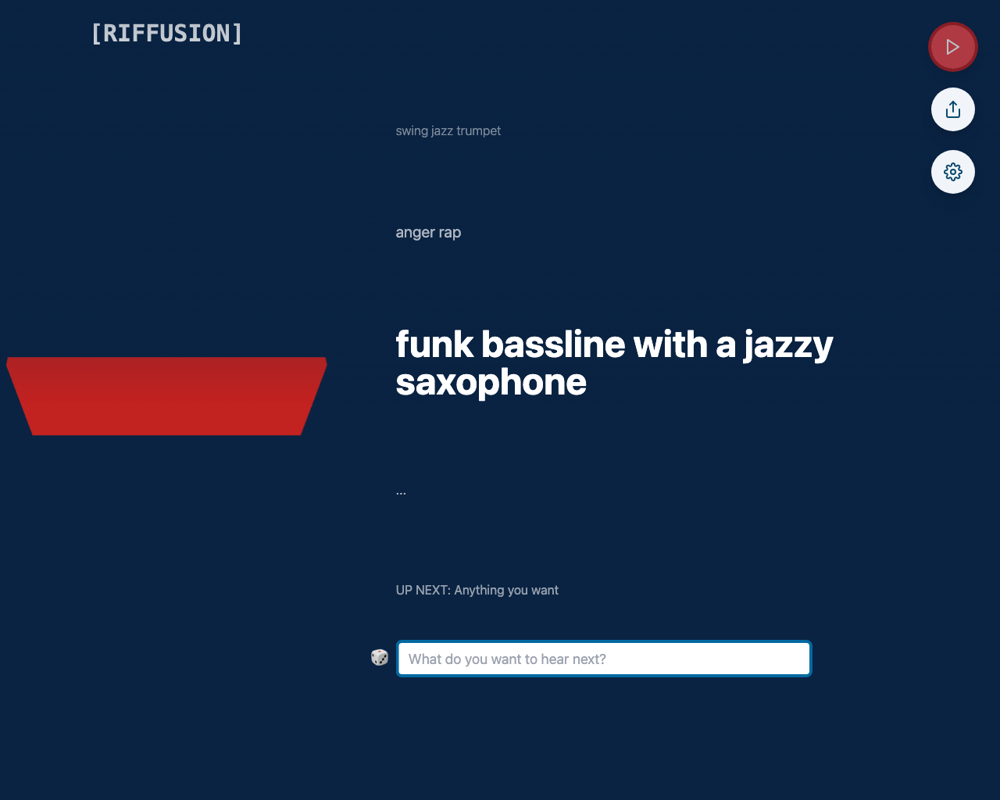
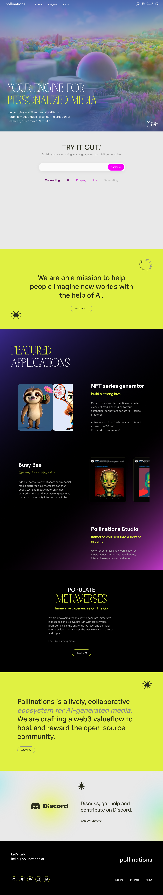
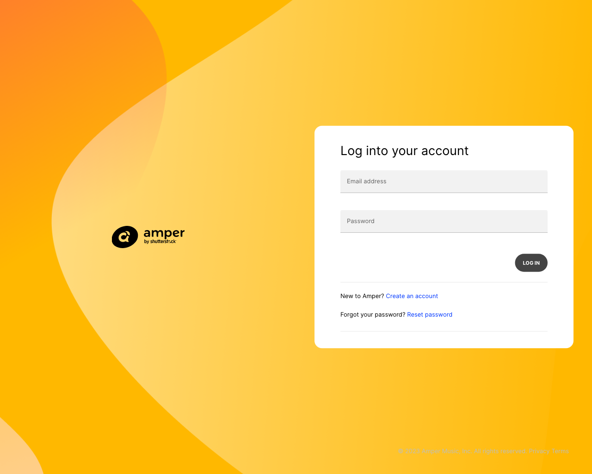
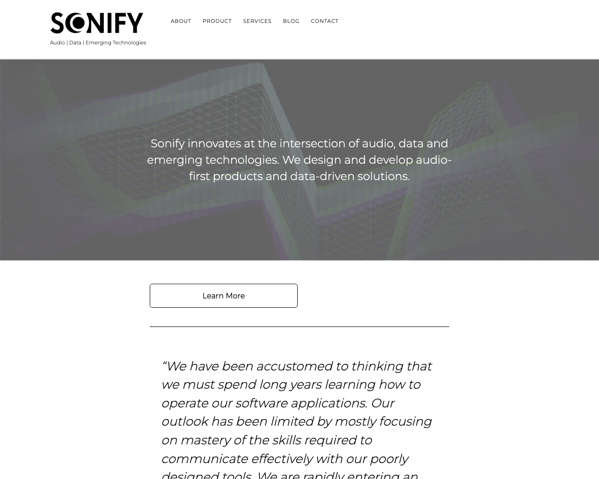
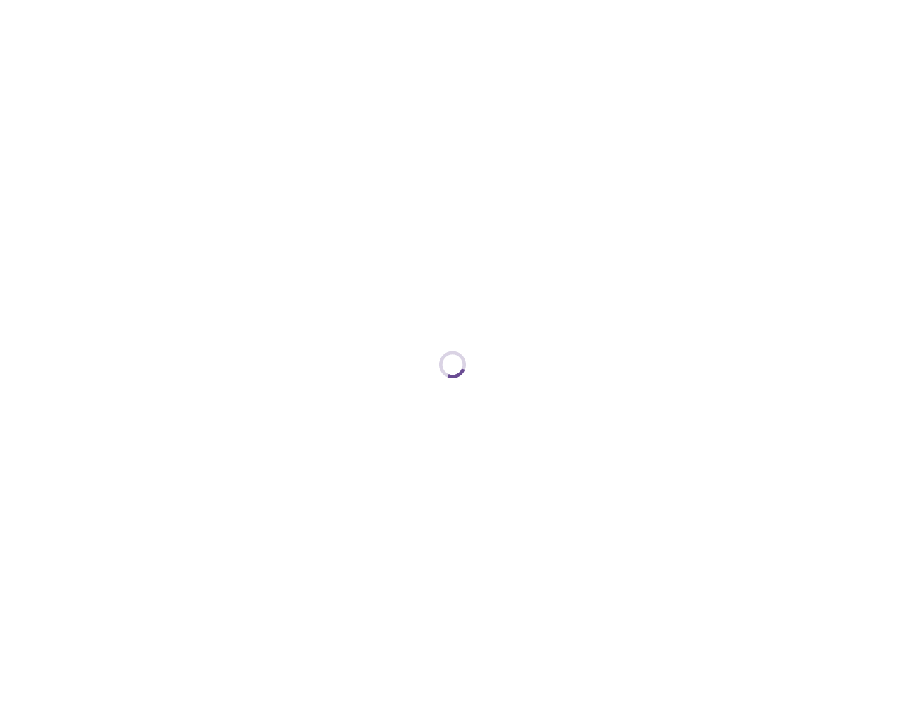

# 🎵Music

This page lists a collection of 🎵Music tools.

## Tools

### [Riffusion](https://www.riffusion.com)

 
- **Link**: https://www.riffusion.com
- **Pricing**: -

### [Boomy](https://boomy.com)

 
- **Link**: https://boomy.com
- **Pricing**: -

### [Pollinations](https://pollinations.ai)

 
- **Link**: https://pollinations.ai
- **Pricing**: -

### [Harmonai](https://www.harmonai.org)

 
- **Link**: https://www.harmonai.org
- **Pricing**: -

### [Endel](https://endel.io)

 
- **Link**: https://endel.io
- **Pricing**: -

### [Natural Language Playlist](https://www.naturallanguageplaylist.com)

 
- **Link**: https://www.naturallanguageplaylist.com
- **Pricing**: -

### [Beatoven.ai](https://www.beatoven.ai)

 
- **Link**: https://www.beatoven.ai
- **Pricing**: -

### [Emergent Drums](https://audialab.com)

 
- **Link**: https://audialab.com
- **Pricing**: -

### [Open Voice OS](https://openvoiceos.com)

 
- **Link**: https://openvoiceos.com
- **Pricing**: -

### [Pop2Piano](https://sweetcocoa.github.io/pop2piano_samples)

 
- **Link**: https://sweetcocoa.github.io/pop2piano_samples
- **Pricing**: -

### [Soundful](https://soundful.com)

 
- **Link**: https://soundful.com
- **Pricing**: -

### [Amper](https://score.ampermusic.com)

 
- **Link**: https://score.ampermusic.com
- **Pricing**: -

### [Sonify](https://www.sonify.io)

 
- **Link**: https://www.sonify.io
- **Pricing**: -

### [Daft Art](https://daftart.ai)

 
- **Link**: https://daftart.ai
- **Pricing**: -

### [Quasi](https://quasi.market)

 
- **Link**: https://quasi.market
- **Pricing**: -

### [Songtell](https://songtell.com)

 
- **Link**: https://songtell.com
- **Pricing**: -

[Go back](../README.md) [JSON](json/Music.json)