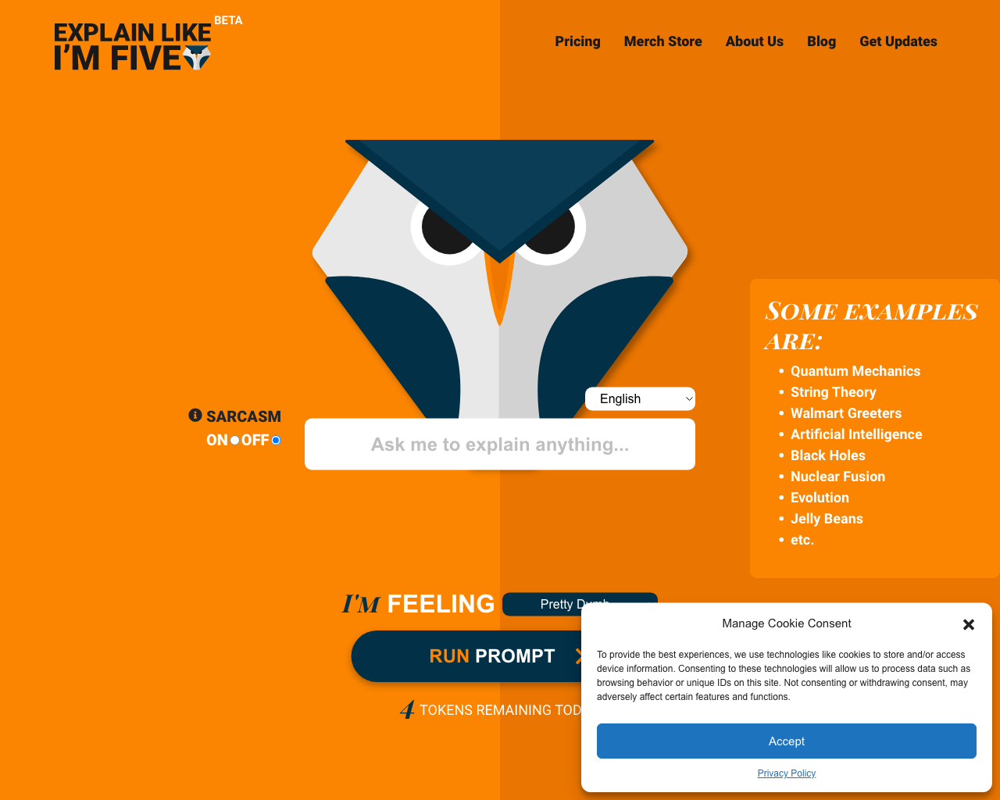
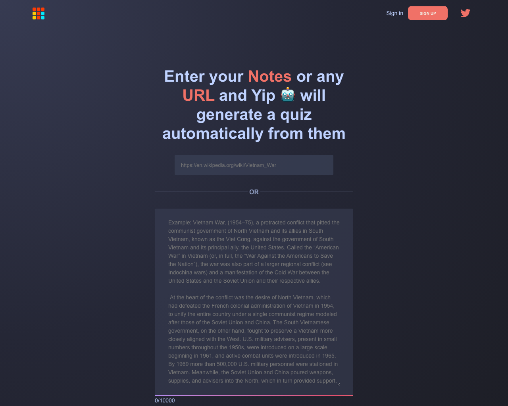
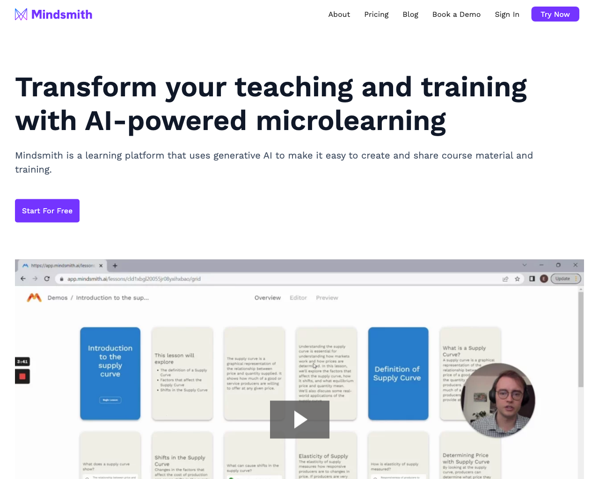
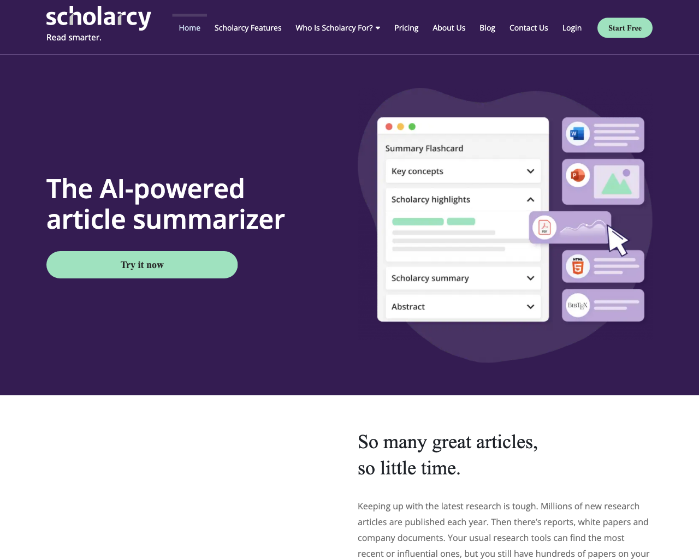
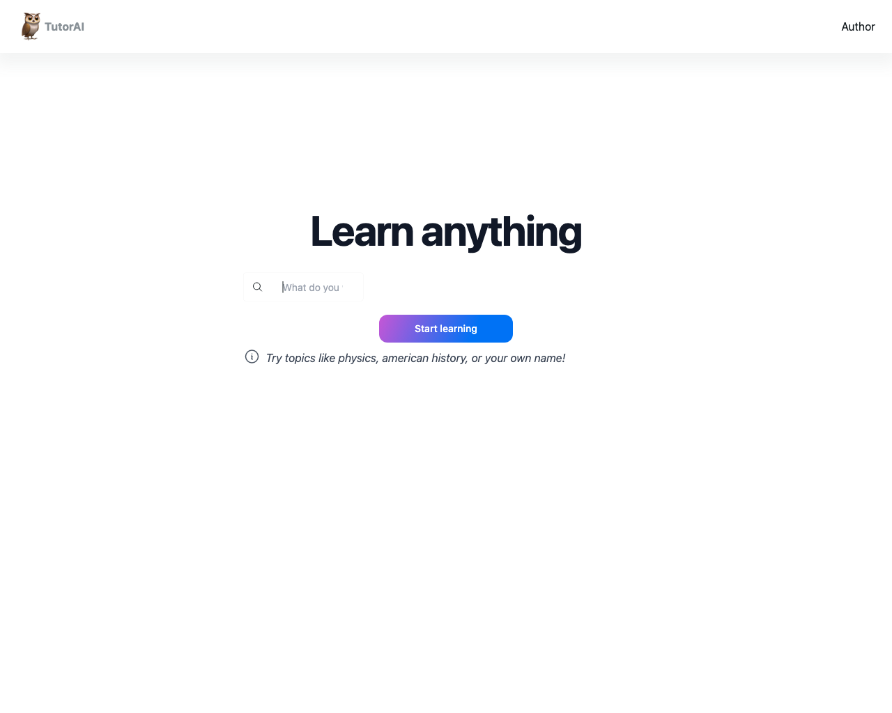
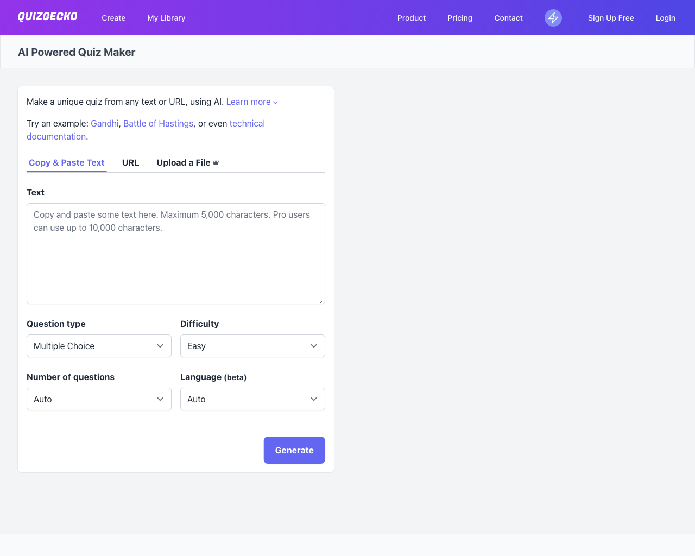

# 🏫 Education Assistant

This page lists a collection of 🏫 Education Assistant tools.

## Tools

### [ELI5](https://explainlikeimfive.io)

 
- **Link**: https://explainlikeimfive.io
- **Pricing**: -

### [LiveReacting AI](https://www.livereacting.com/ai-host-for-live-stream)

 
- **Link**: https://www.livereacting.com/ai-host-for-live-stream
- **Pricing**: -

### [Yip](https://yippity.io)

 
- **Link**: https://yippity.io
- **Pricing**: -

### [Caktus](https://www.caktus.ai)

 
- **Link**: https://www.caktus.ai
- **Pricing**: -

### [MindSmith](https://www.mindsmith.ai)

 
- **Link**: https://www.mindsmith.ai
- **Pricing**: -

### [Scholarcy](https://www.scholarcy.com)

 
- **Link**: https://www.scholarcy.com
- **Pricing**: -

### [TutorAI](https://www.tutorai.me)

 
- **Link**: https://www.tutorai.me
- **Pricing**: -

### [Quizgecko](https://quizgecko.com)

 
- **Link**: https://quizgecko.com
- **Pricing**: -

[Go back](../README.md) [JSON](json/Education.json)