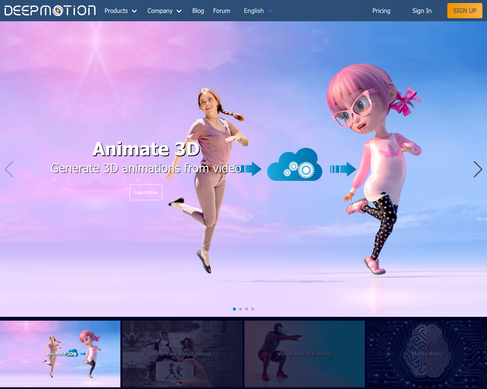
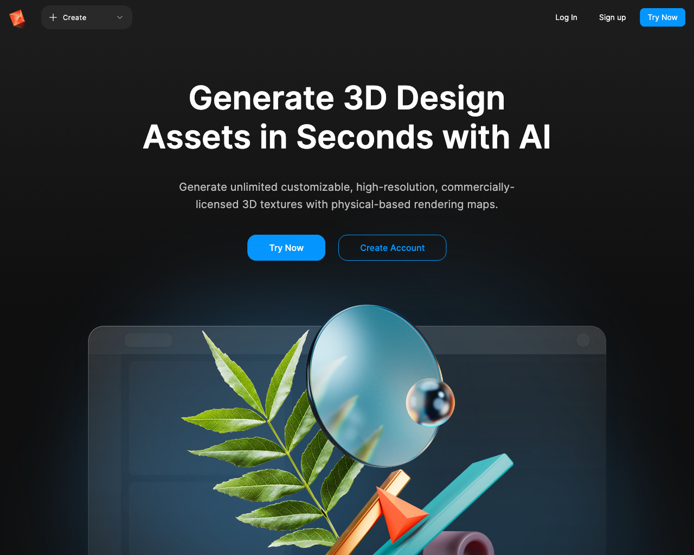
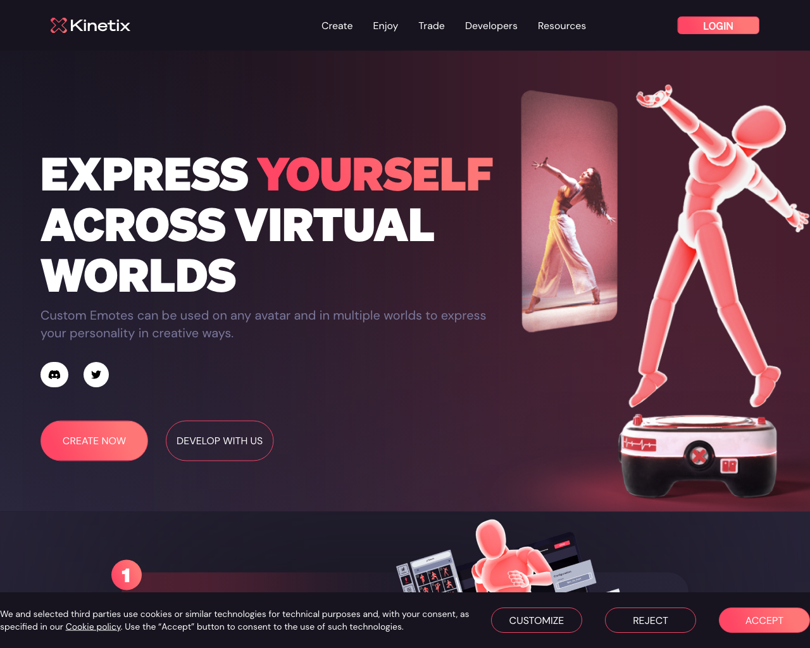
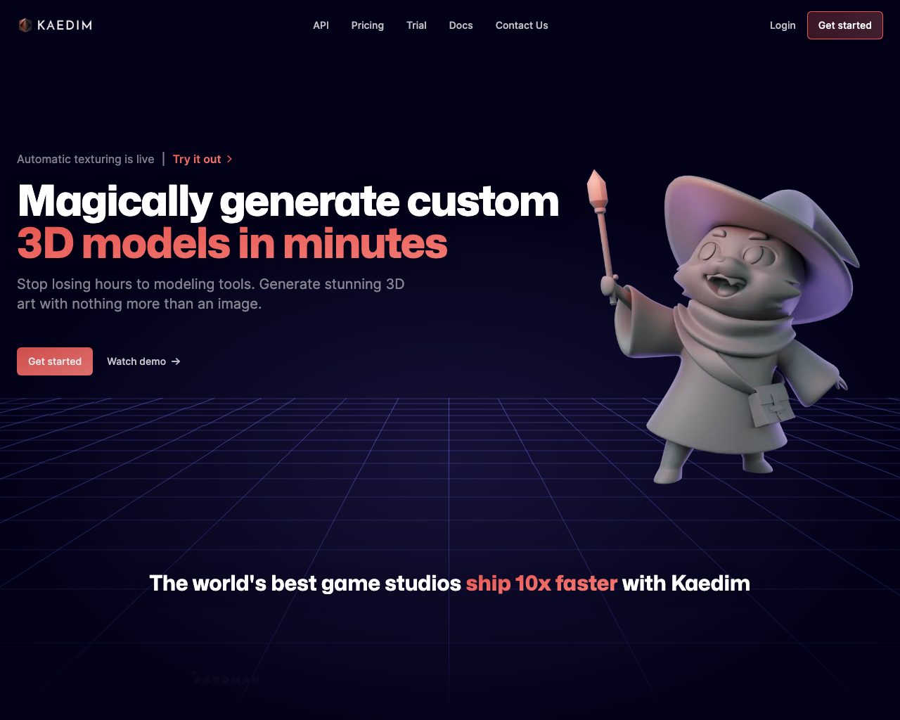
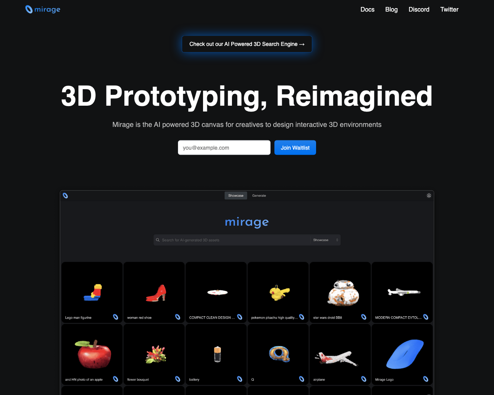
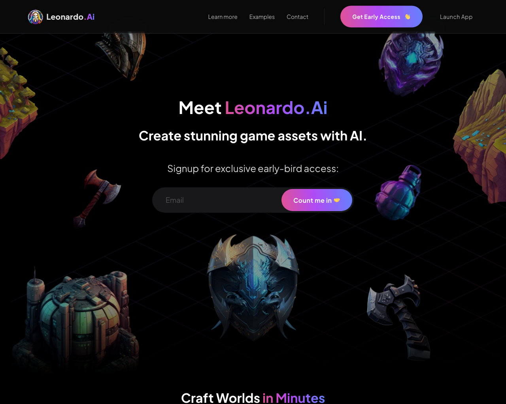
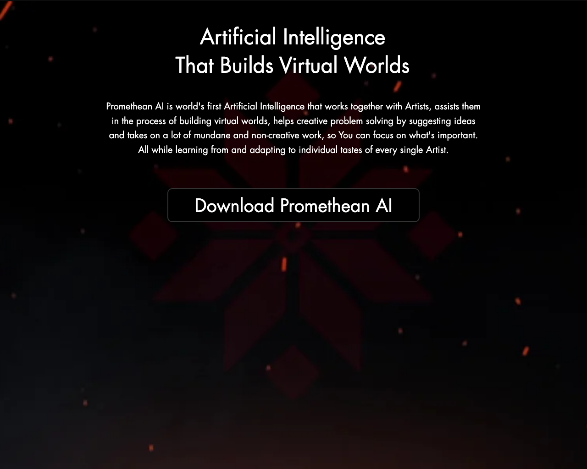
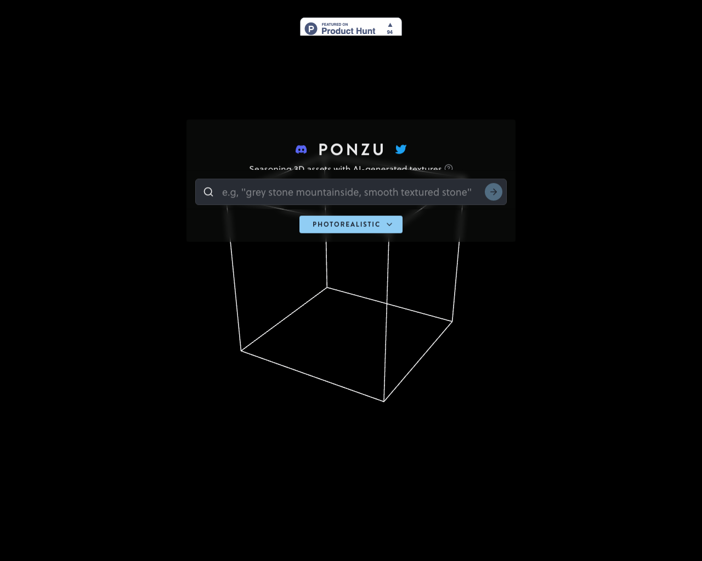
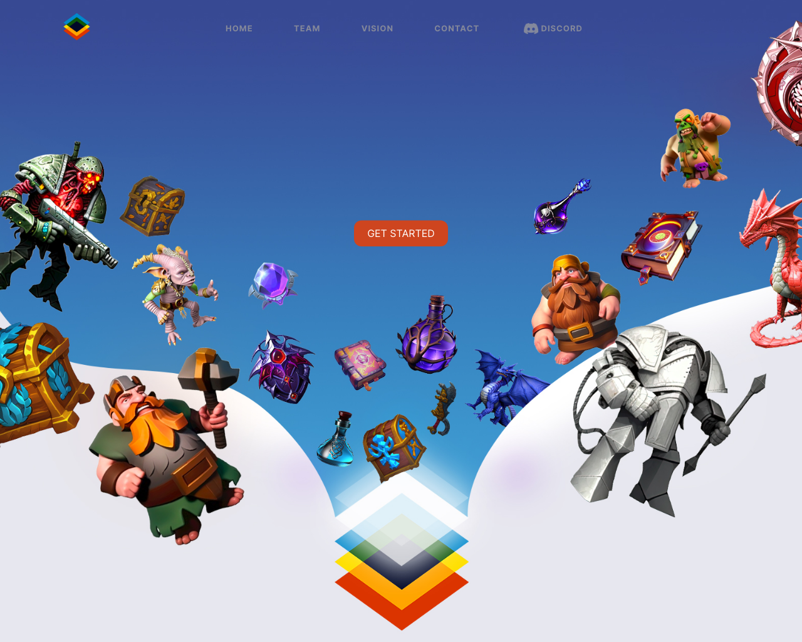

# 📍 3D

This page lists a collection of 📍 3D tools.

## Tools

### [Pixela AI](https://pixela.ai)

Pixela AI is an AI tool that generates game textures using machine learning technology. It offers developers a fast and cost-effective solution for creating high-quality game textures. It also offers customization options for unique texture styles. Pixela AI is a powerful and versatile tool for game texture generation. 

- **Link**: https://pixela.ai
- **Pricing**: Free

### [GET3D](Nvidia)

GET3D is a generative model for creating high-quality 3D textured shapes, learned from images. It offers a unique solution for creating 3D shapes with realistic textures and detailed features. GET3D leverages machine learning technology to deliver efficient and accurate results, making it a valuable tool for industries such as gaming, architecture, and product design.

- **Link**: https://nv-tlabs.github.io/GET3D"
- **Pricing**: -

### [GetFloorPlan](https://getfloorplan.com)

Getfloorplan Lab is a tool designed to enhance real estate sales. It provides 2D and 3D floor plans and virtual tours, which have been shown to increase sales calls by up to 30% according to its clients. Getfloorplan Lab is an effective solution for real estate professionals looking to boost their sales and stand out in the market. By offering engaging and interactive visual experiences, Getfloorplan Lab helps potential buyers envision and connect with properties. 
- **Link**: https://getfloorplan.com
- **Pricing**: Free

### [Texture Lab](https://www.texturelab.xyz)

Texture Lab is a tool for creating unique seamless textures for games. It allows users to generate textures from any text, offering an instant solution for adding personalized textures to their games. Texture Lab is user-friendly and offers customization options to produce high-quality textures efficiently and effectively. It is a valuable asset for game developers and artists looking for unique and customized textures for their games.

- **Link**: https://www.texturelab.xyz
- **Pricing**: -

### [DeepMotion](https://www.deepmotion.com)

Deepmotion is a powerful AI tool that transforms animation pipelines. It offers markerless motion capture and real-time 3D body tracking solutions through web and mobile platforms, leading the industry in animation technology.

- **Link**: https://www.deepmotion.com
- **Pricing**: Free

### [Poly](https://withpoly.com)

Poly is an AI-powered tool that enables users to create unlimited 3D design assets quickly. It features customizable, high-resolution, commercially-licensed 3D textures with physical-based rendering maps.

- **Link**: https://withpoly.com
- **Pricing**: -

### [Kinetix](https://www.kinetix.tech)

Kinetix is a virtual world platform that allows users to express themselves through custom emotes. The emotes can be used on any avatar and in multiple virtual worlds, providing unique and creative ways to showcase personality.

- **Link**: https://www.kinetix.tech
- **Pricing**: -

### [Kaedim](https://www.kaedim3d.com)

Kaedim is a magical tool that generates custom 3D models in minutes. Say goodbye to spending hours on modeling tools. With Kaedim, users can easily create stunning 3D art with just an image.

- **Link**: https://www.kaedim3d.com
- **Pricing**: 599$ mo

### [Mirageml](https://www.mirageml.com)

MirageML is an AI-powered 3D prototyping tool that transforms the traditional design process. It allows creatives to effortlessly design beautiful environments on a user-friendly 3D canvas. Reimagine 3D prototyping with MirageML.

- **Link**: https://www.mirageml.com
- **Pricing**: 

### [Leonardo.Ai](https://leonardo.ai)

Leonardo.Ai is an AI tool that enables users to create stunning game assets. Meet Leonardo.Ai and revolutionize your game asset creation process.

- **Link**: https://leonardo.ai
- **Pricing**: -

### [PrometheanAI](https://www.prometheanai.com)

PrometheanAI is a groundbreaking AI tool that assists artists in building virtual worlds. It takes on mundane tasks and offers creative solutions, allowing artists to focus on what's important. With PrometheanAI, virtual world building is transformed by artificial intelligence that adapts to individual artist's tastes.

- **Link**: https://www.prometheanai.com
- **Pricing**: -

### [Ponzu](https://www.ponzu.gg)

Ponzu is an AI tool that adds flavor to 3D assets by generating textures. Season your 3D assets with Ponzu's AI-generated textures.
 
- **Link**: https://www.ponzu.gg
- **Pricing**: -

### [The Simulation](https://fablesimulation.com)

 
The Simulation is a cutting-edge metaverse powered by Artificial Intelligence, designed to change the way we interact with virtual environments. With advanced machine learning, innovative game design, Non-Fungible Tokens (NFTs), and the ERC20 token, $SIM, this new digital world is poised to be a game-changer. Unlike traditional virtual worlds, only AI-powered NFTs will be represented in The Simulation, meaning that human presence will be absent. This creates a unique opportunity for AI entities to interact with each other in a virtual environment, free from human influence. The Simulation is a new frontier in AI development, and will allow developers, researchers, and artists to explore the possibilities of AI-powered virtual environments. The combination of sophisticated technology and the ability to trade AI NFTs opens up a world of potential, and provides a glimpse into the future of virtual worlds. Get ready to experience the next level of artificial intelligence with The Simulation.

- **Link**: https://fablesimulation.com
- **Pricing**: -

### [G3DAI {Jedi}](https://g3d.ai)

G3DAI is a game development platform that transforms imagination into reality. With its cutting-edge AI technology, game creators can build stunning, unique games in a fraction of the time. G3DAI offers a suite of tools, each one expertly crafted to boost creativity and eliminate manual tasks, allowing game creators to focus on what really matters - creating games that captivate players and bring their visions to life. From dream to reality, G3DAI makes it possible to imagine any game and play it. Get ready to bring your game ideas to life with G3DAI.

- **Link**: https://g3d.ai
- **Pricing**: -

### [Imagine 3D](https://captures.lumalabs.ai/imagine)

Imagine 3D v1.2 (alpha) is a cutting-edge technology that allows you to create 3D models with just text. It's an early experiment aimed at revolutionizing the way 3D models are created, making it easier and more accessible. With Imagine 3D, you no longer have to be an expert in 3D design to bring your ideas to life. Access to this exciting technology is gradually expanding, and it's available to everyone on the waitlist. Whether you're a game designer, architect, or artist, Imagine 3D v1.2 (alpha) offers endless possibilities to bring your imagination to reality. Get ready to experience the future of 3D design with this innovative tool.

- **Link**: https://captures.lumalabs.ai/imagine
- **Pricing**: -

### [Masterpiece Studio](https://masterpiecestudio.com)

Masterpiece Studio is a cutting-edge platform that combines generative AI with ease of use to revolutionize the world of 3D design. With Masterpiece Studio, creating beautiful 3D designs is effortless, as the platform leverages the power of generative AI to take the hassle out of the design process. Whether you're an experienced designer or just starting out, Masterpiece Studio provides an intuitive and user-friendly interface that makes 3D design accessible to everyone. By being the first commercially available 3D generative AI platform, Masterpiece Studio is poised to change the game and make 3D design accessible to anyone with a creative vision.

- **Link**: https://masterpiecestudio.com
- **Pricing**: -

### [Plask](https://plask.ai)

 
Plask is a cutting-edge technology that revolutionizes the process of extracting motion from video. It eliminates the need for expensive bodysuits or motion capture work, making it effortless and accessible to everyone. With its seamless integration with other tools and support for most professional file formats, including GLB, FBX, BVH, and more, Plask is the ideal choice for both solo artists and team collaborations. With the ability to extract motion just from video, Plask streamlines your workflow and makes it easier than ever to bring your visions to life. Get ready to elevate your game and bring your creations to the next level with Plask.

- **Link**: https://plask.ai
- **Pricing**: -

### [Luma AI](https://lumalabs.ai)

Luma AI is revolutionizing the way we capture and experience memories. With a focus on three dimensional images, Luma is breaking down the barriers of 2D photos and videos. Their mission is to bring about a change in the way we share memories, explore products, and spaces on the internet by bringing them to life in lifelike 3D. By harnessing the power of mixed-reality technology, Luma is propelling us into the future of image capture and preservation. Say goodbye to flat, two dimensional memories and say hello to a new, immersive world with Luma AI.

- **Link**: https://lumalabs.ai
- **Pricing**: -

### [CSM](https://csm.ai)

CSM is revolutionizing the world of artificial intelligence. With its advanced technology, you can now create, simulate, and manipulate 3D worlds. Their APIs, interfaces, and open-source software enable the translation of multi-modal inputs into a digital simulator, perfect for AI training and content creation. CSM's mission is to bring artificial intelligence to the next level by providing a systematic path towards AGI, similar to the way a child learns about the world through experience. With CSM, you'll have the power to bring your imagination to life in a digital world.

- **Link**: https://csm.ai
- **Pricing**: -

### [Scenario](https://www.scenario.gg)

Scenario is an AI-powered tool for game asset creation. It offers a solution for generating high-quality and style-consistent assets for game developers. With Scenario, you can create your own AI engine, custom-trained with your own data. This enables you to unlock astonishing creativity and quickly test new game concepts and ideas. With its efficient prompting system, Scenario speeds up your production and generates unique, high-quality content that is cohesive with your art direction. Say goodbye to the time-consuming process of manual asset creation, and welcome to the future of game development with Scenario.

- **Link**: https://www.scenario.gg
- **Pricing**: -

[Go back](../README.md) [JSON](json/3D.json)