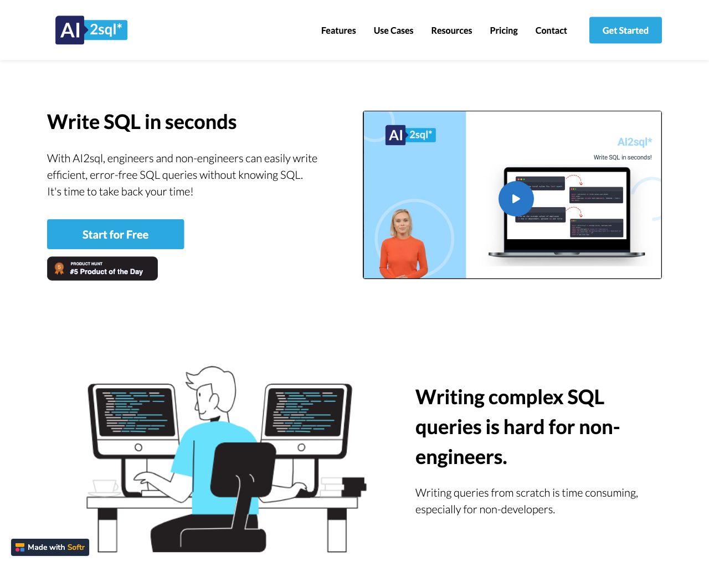
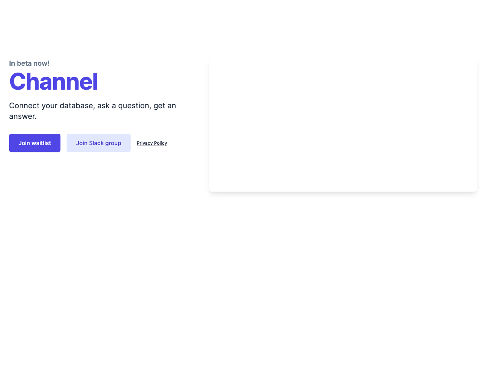
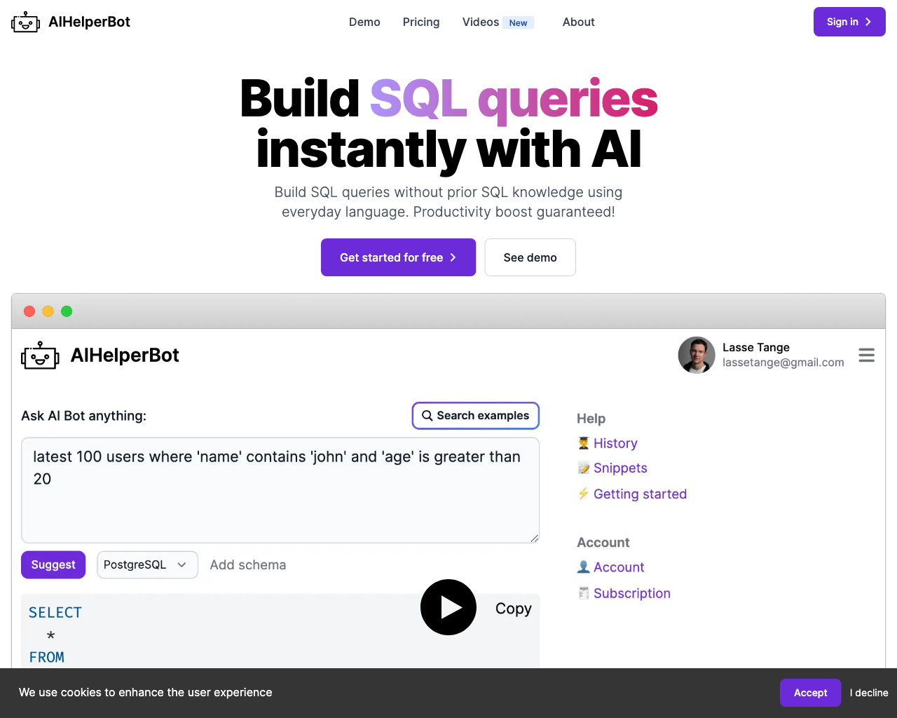
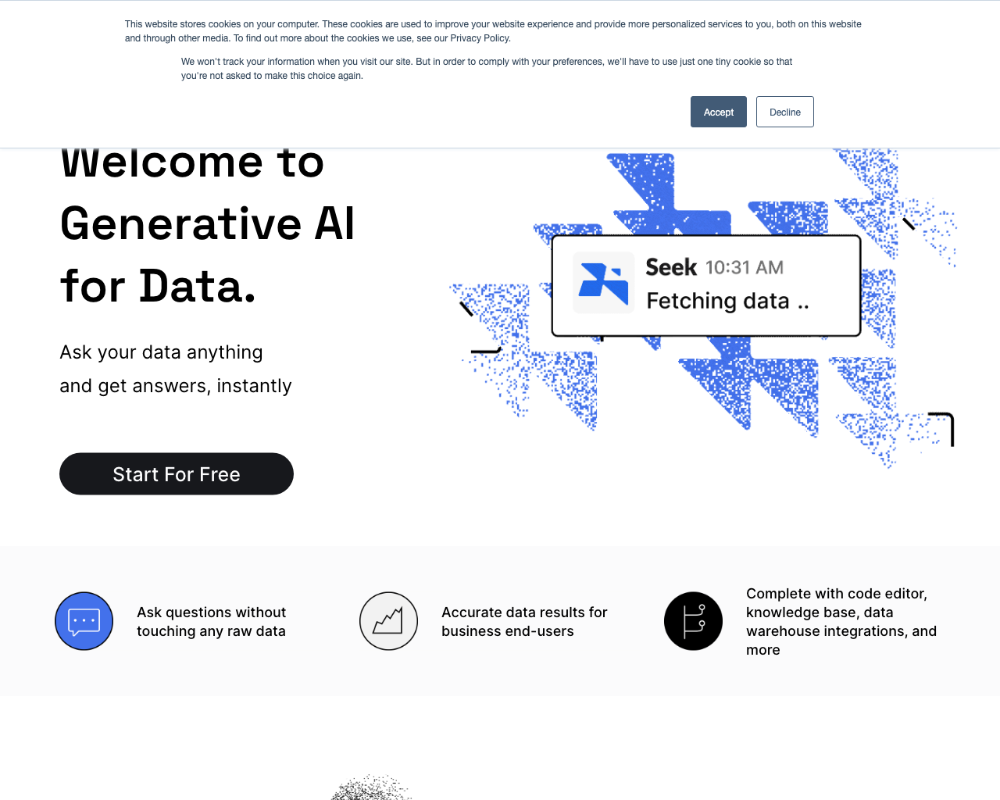
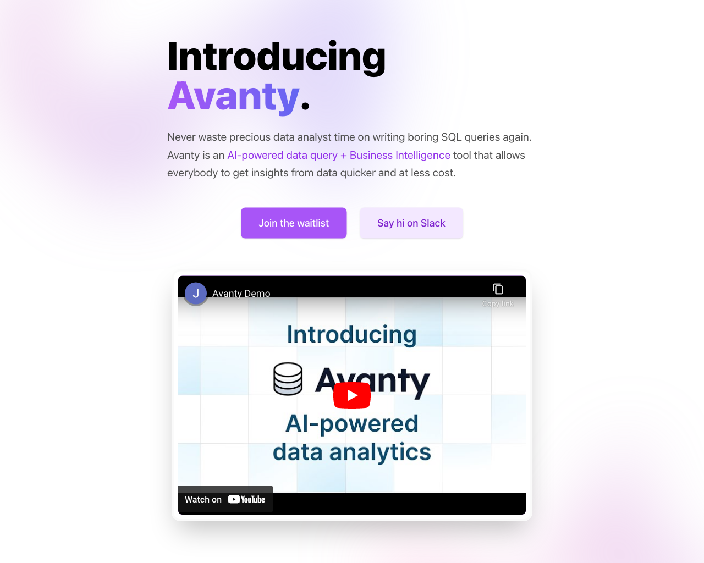
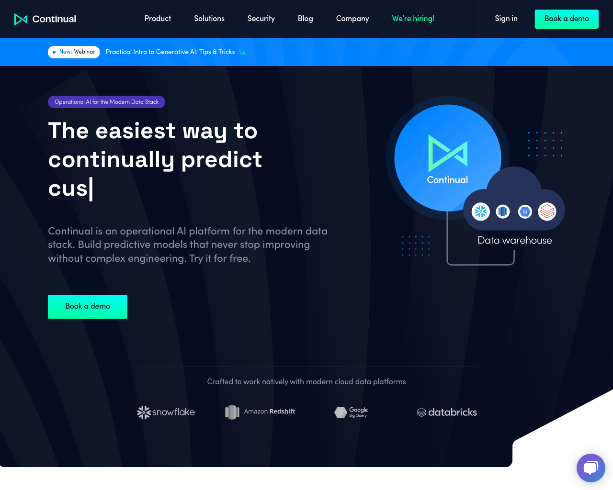
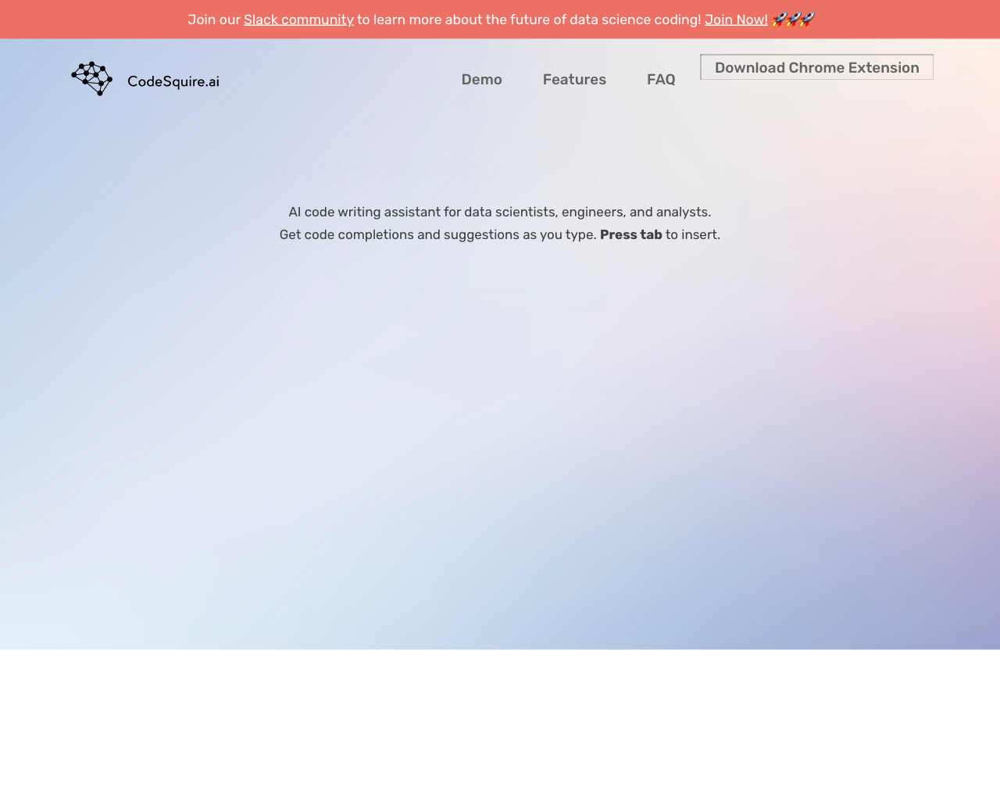

# 🤵‍♀️ SQL

This page lists a collection of 🤵‍♀️ SQL tools.

## Tools

### [AI Data Sidekick](https://www.airops.com)

 
- **Link**: https://www.airops.com
- **Pricing**: -

### [Ai2sql](https://www.ai2sql.io)

 
- **Link**: https://www.ai2sql.io
- **Pricing**: -

### [Channel](https://www.usechannel.com)
 
AI Channel is a tool that allows you to connect to your database and get answers to questions asked in a simple and efficient manner. It operates on artificial intelligence and natural language processing, allowing you to access accurate and reliable information in just a few simple steps. With AI Channel, you can get quick and accurate results without the need to write complex code or perform lengthy manual searches. This makes AI Channel an ideal tool for those seeking quick and reliable solutions for managing their database.
- **Link**: https://www.usechannel.com
- **Pricing**: -

### [AIHelperBot](https://aihelperbot.com)

 
- **Link**: https://aihelperbot.com
- **Pricing**: -

### [Seek](https://www.seek.ai)

 
- **Link**: https://www.seek.ai
- **Pricing**: -

### [Avanty](https://avanty.app)

 
- **Link**: https://avanty.app
- **Pricing**: -

### [Continual](https://continual.ai)

 
- **Link**: https://continual.ai
- **Pricing**: -

### [CodeSquire](https://codesquire.ai)

 
- **Link**: https://codesquire.ai
- **Pricing**: -

[Go back](../README.md) [JSON](json/SQL.json)