# 🥷 Code Assistant

This page lists a collection of 🥷 Code Assistant tools.

## Tools

### [Replit](https://replit.com)
<a href="https://replit.com">
   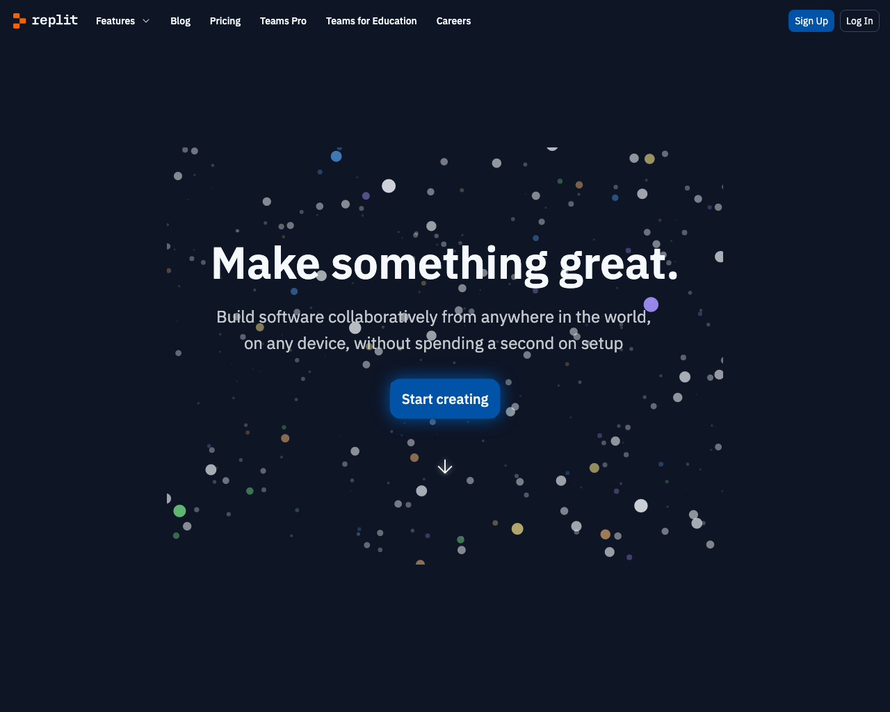
</a>
 
- **Link**: https://replit.com
- **Pricing**: -

### [AutoRegex](https://www.autoregex.xyz)

 
- **Link**: https://www.autoregex.xyz
- **Pricing**: -

### [Amazon CodeWhisperer](https://aws.amazon.com/codewhisperer)

 
- **Link**: https://aws.amazon.com/codewhisperer
- **Pricing**: -

### [Tabnine](https://www.tabnine.com)
<a href="https://www.tabnine.com">
   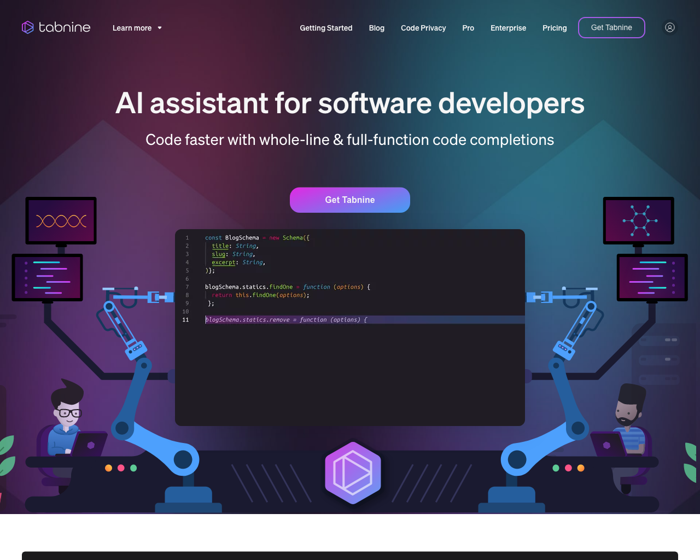
</a>
 
- **Link**: https://www.tabnine.com
- **Pricing**: -

### [Copilot](https://github.com/features/copilot)
<a href="https://github.com/features/copilot">
   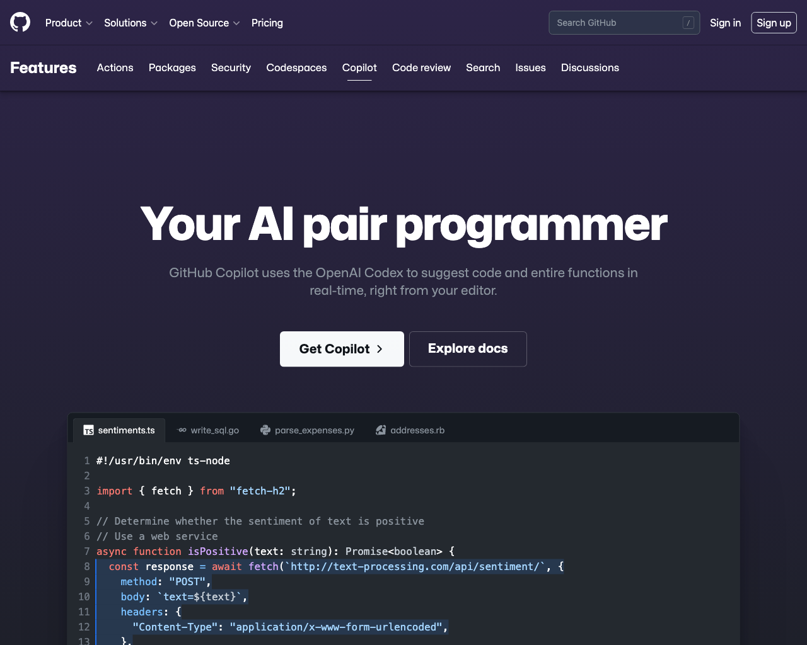
</a>
 
- **Link**: https://github.com/features/copilot
- **Pricing**: -

### [AI CLI](https://github.com/abhagsain/ai-cli)

 
- **Link**: https://github.com/abhagsain/ai-cli
- **Pricing**: -

### [Codeium](https://www.codeium.com)
<a href="https://www.codeium.com">
   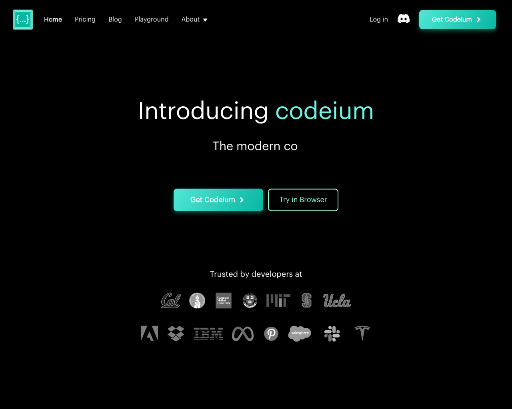
</a>
 
- **Link**: https://www.codeium.com
- **Pricing**: -

### [Lookup](https://app.uselookup.com)
<a href="https://app.uselookup.com">
   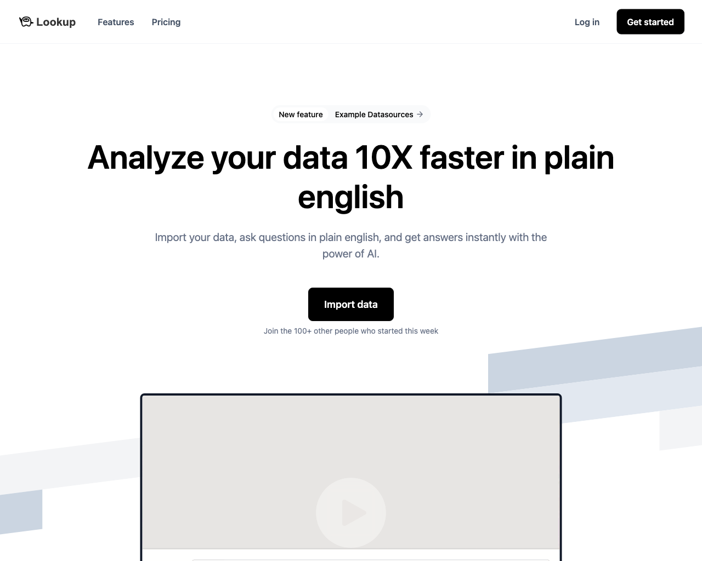
</a>
 
- **Link**: https://app.uselookup.com
- **Pricing**: -

### [Duino Code Generator](https://www.duinocodegenerator.com)

 
- **Link**: https://www.duinocodegenerator.com
- **Pricing**: -

### [Kodezi ai](https://kodezi.com)

 
- **Link**: https://kodezi.com
- **Pricing**: -

### [Maverick]([Maverick](https://marketplace.visualstudio.com/items?itemName=YurtsAI.maverick)

)
- **Link**: [Maverick](https://marketplace.visualstudio.com/items?itemName=YurtsAI.maverick
- **Pricing**: https

### [Buildt](https://www.buildt.ai)
<a href="https://www.buildt.ai">
   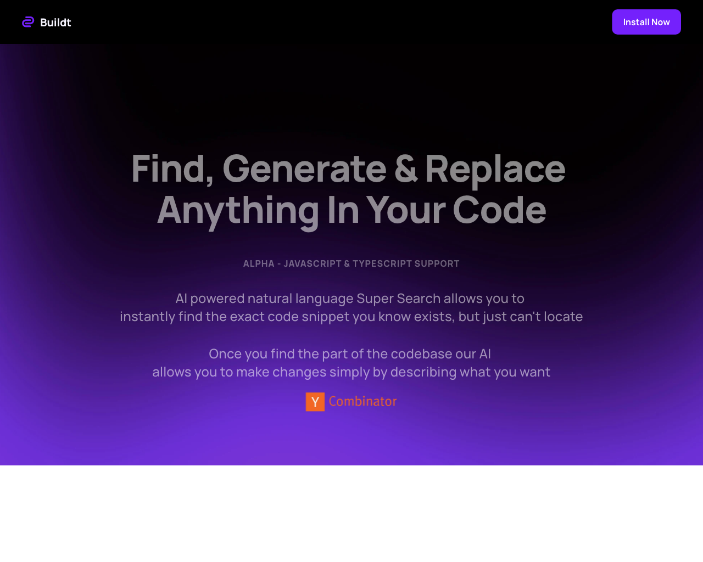
</a>
 
- **Link**: https://www.buildt.ai
- **Pricing**: -

### [BlackBox AI](https://www.useblackbox.io)

 
- **Link**: https://www.useblackbox.io
- **Pricing**: -

### [Spellbox](https://spellbox.app)
<a href="https://spellbox.app">
   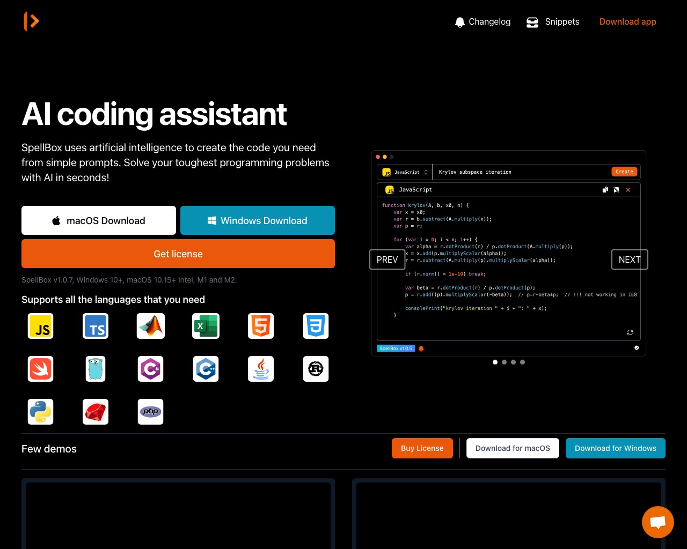
</a>
 
- **Link**: https://spellbox.app
- **Pricing**: -

### [CodeGeeX](https://huggingface.co/spaces/THUDM/CodeGeeX)
<a href="https://huggingface.co/spaces/THUDM/CodeGeeX">
   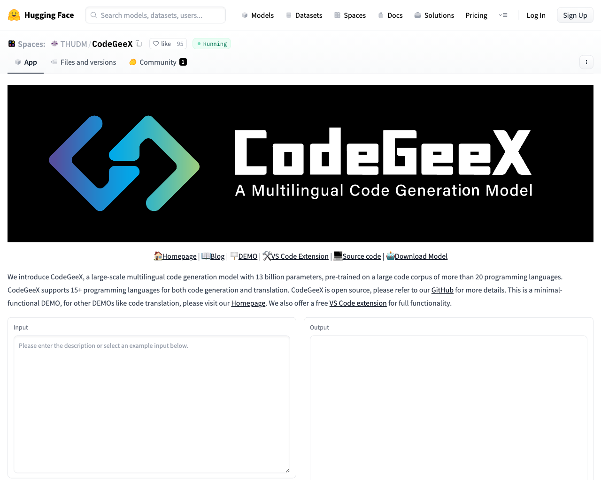
</a>
 
- **Link**: https://huggingface.co/spaces/THUDM/CodeGeeX
- **Pricing**: -

### [Cheat Layer](https://cheatlayer.com)

 
- **Link**: https://cheatlayer.com
- **Pricing**: -

### [AskCodi](https://www.askcodi.com)
<a href="https://www.askcodi.com">
   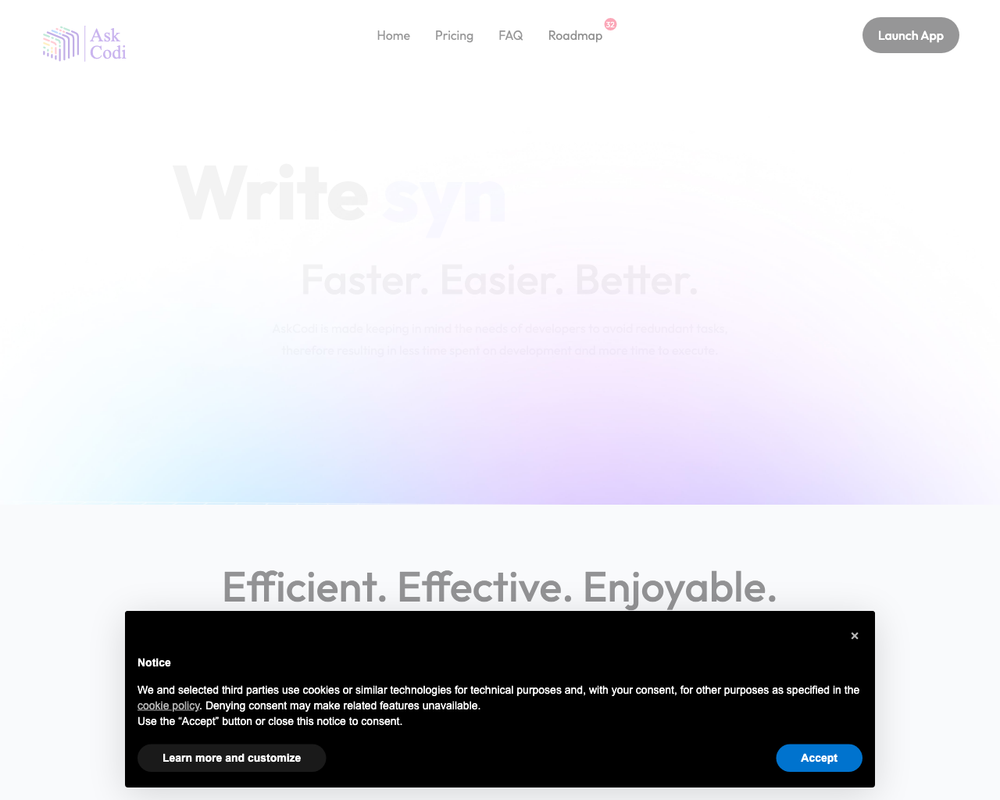
</a>
 
- **Link**: https://www.askcodi.com
- **Pricing**: -

### [Programminghelper](https://www.programming-helper.com)
<a href="https://www.programming-helper.com">
   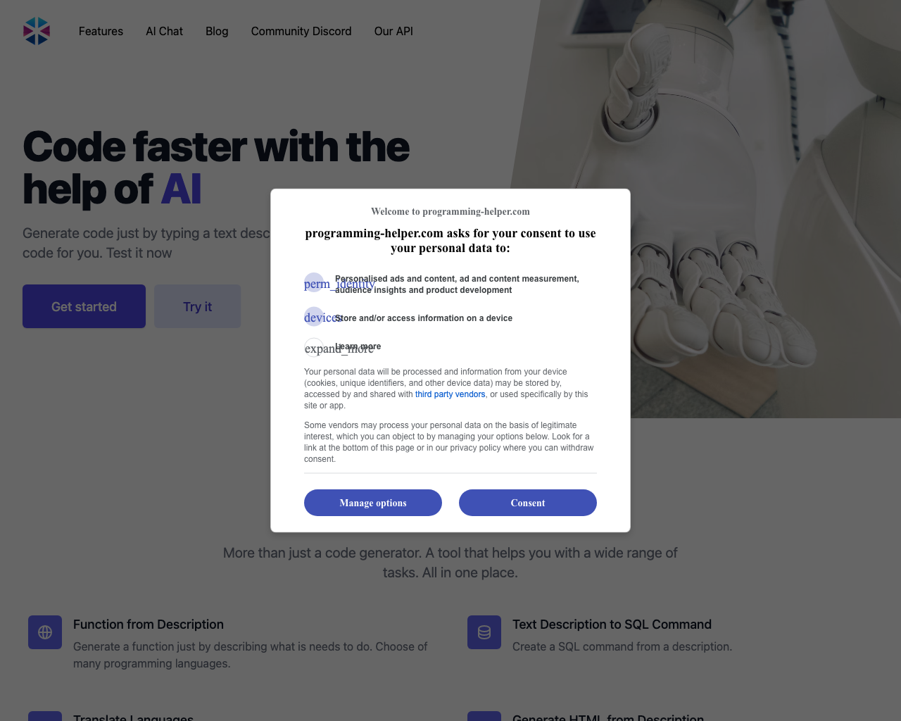
</a>
 
- **Link**: https://www.programming-helper.com
- **Pricing**: -

### [CodeAssist](https://plugins.jetbrains.com/plugin/20085-codeassist)
<a href="https://plugins.jetbrains.com/plugin/20085-codeassist">
   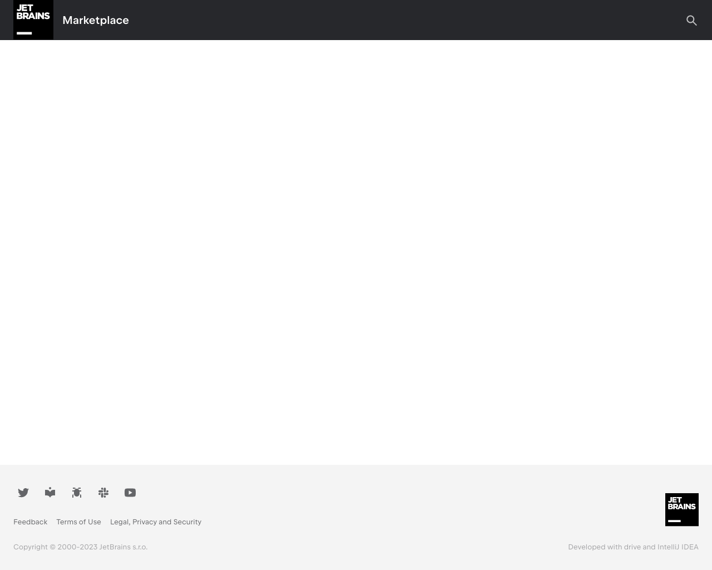
</a>
 
- **Link**: https://plugins.jetbrains.com/plugin/20085-codeassist
- **Pricing**: -

### [Fig AI](https://fig.io/user-manual/ai)

 
- **Link**: https://fig.io/user-manual/ai
- **Pricing**: -

### [Mutable](https://mutable.ai)

 
- **Link**: https://mutable.ai
- **Pricing**: -

### [Clippy AI]([Clippy AI](https://marketplace.visualstudio.com/items?itemName=clippy-ai.clippy-ai)

)
- **Link**: [Clippy AI](https://marketplace.visualstudio.com/items?itemName=clippy-ai.clippy-ai
- **Pricing**: https

### [Continual](https://continual.ai)
<a href="https://continual.ai">
   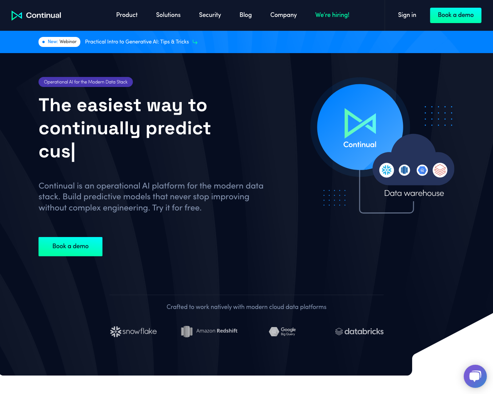
</a>
 
- **Link**: https://continual.ai
- **Pricing**: -

### [Stenography](https://stenography.dev)
<a href="https://stenography.dev">
   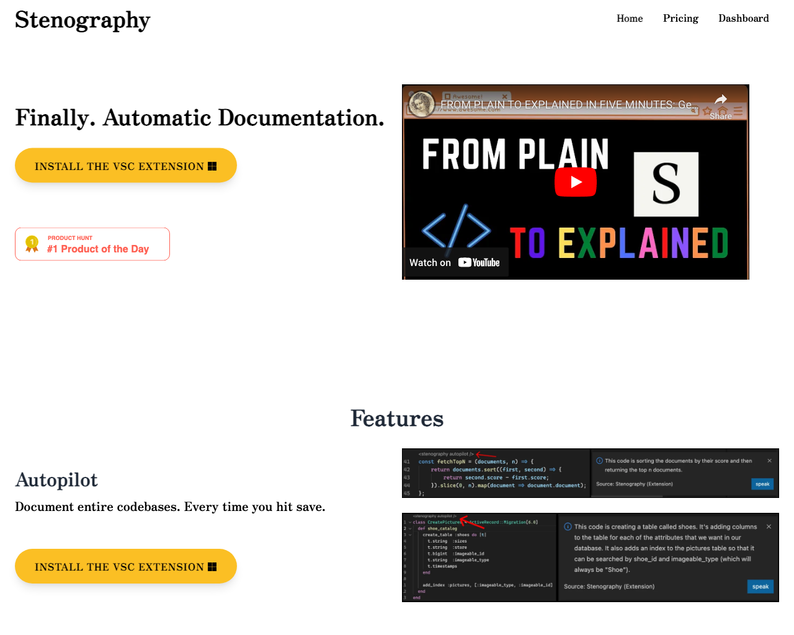
</a>
 
- **Link**: https://stenography.dev
- **Pricing**: -

### [WhatTheDiff](https://whatthediff.ai)
<a href="https://whatthediff.ai">
   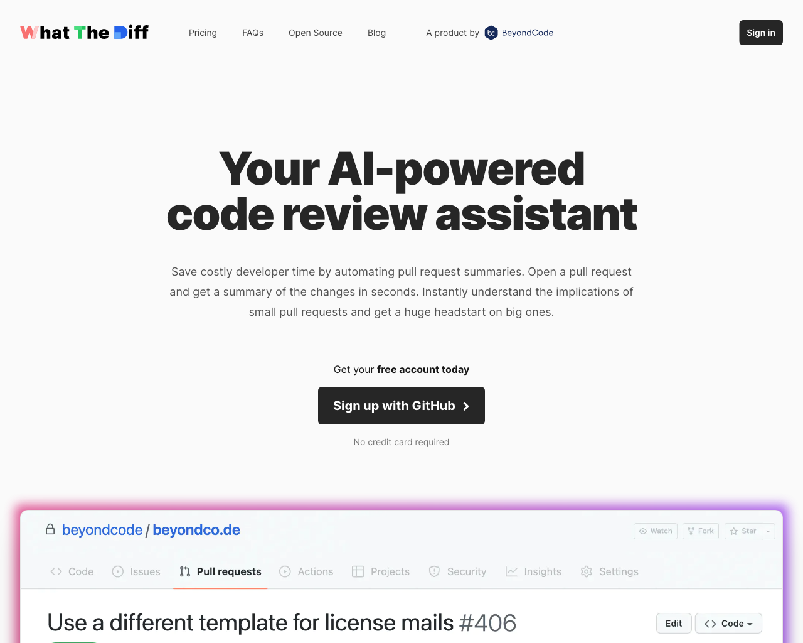
</a>
 
- **Link**: https://whatthediff.ai
- **Pricing**: -

### [Hey, Github!](https://githubnext.com/projects/hey-github)

 
- **Link**: https://githubnext.com/projects/hey-github
- **Pricing**: -

### [CodeSquire](https://codesquire.ai)
<a href="https://codesquire.ai">
   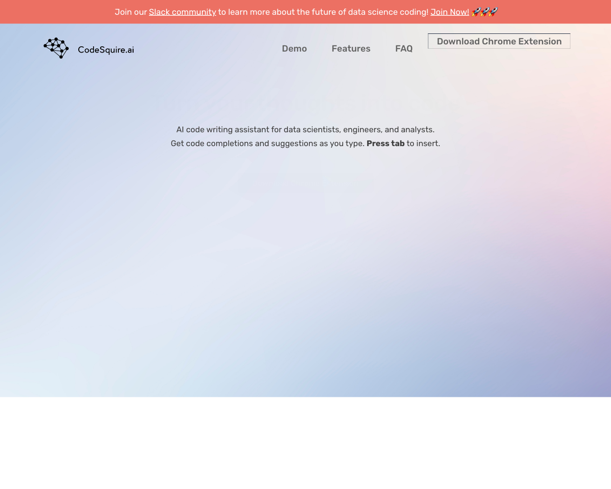
</a>
 
- **Link**: https://codesquire.ai
- **Pricing**: -

[Go back](../README.md) [JSON](json/Code.json)