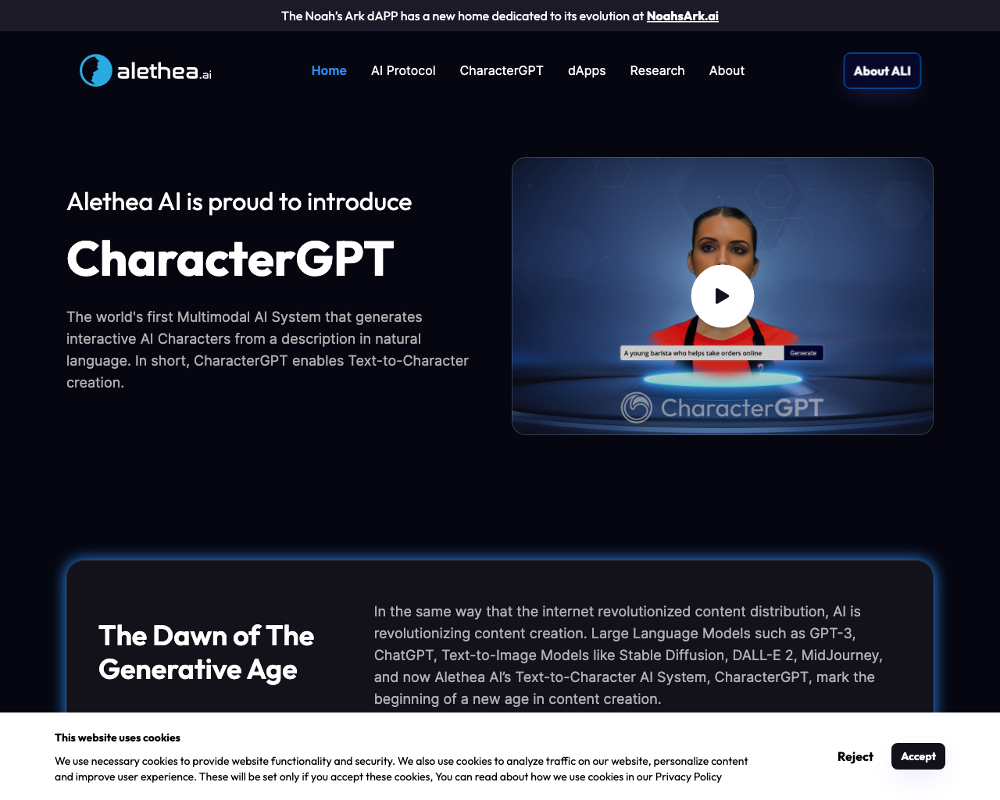

# 🥼 Experiments

This page lists a collection of 🥼 Experiments tools.

## Tools

### [AI Experiments](https://experiments.withgoogle.com/collection/ai)

 
- **Link**: https://experiments.withgoogle.com/collection/ai
- **Pricing**: -

### [Talk To Books](https://books.google.com/talktobooks)

 
- **Link**: https://books.google.com/talktobooks
- **Pricing**: -

### [Ask My Book](https://askmybook.com)

 
- **Link**: https://askmybook.com
- **Pricing**: -

### [Alethea](https://alethea.ai)

 
- **Link**: https://alethea.ai
- **Pricing**: -

[Go back](../README.md) [JSON](json/Experiments.json)