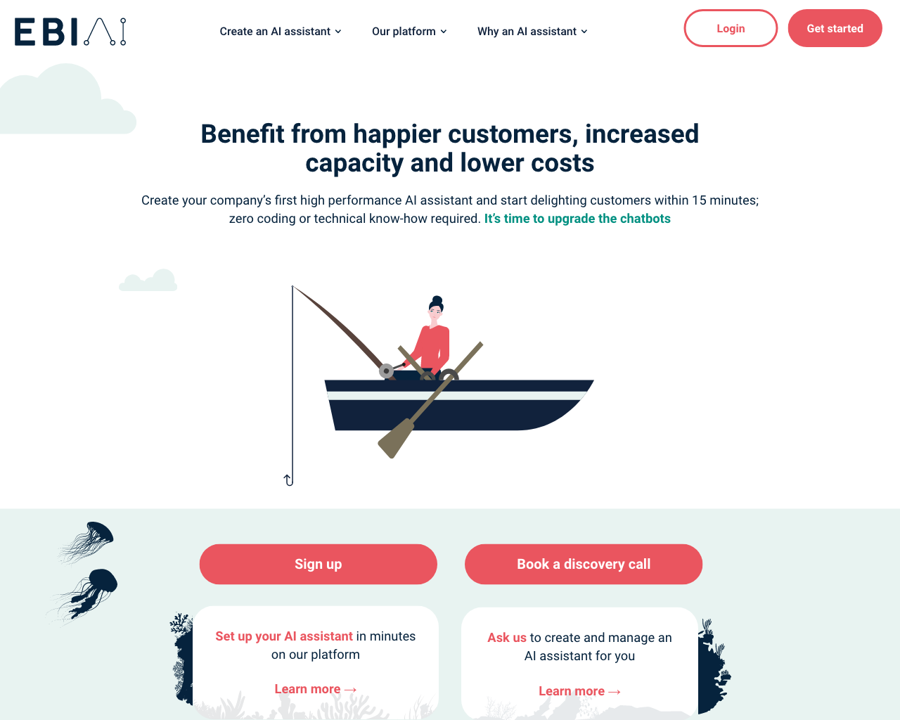
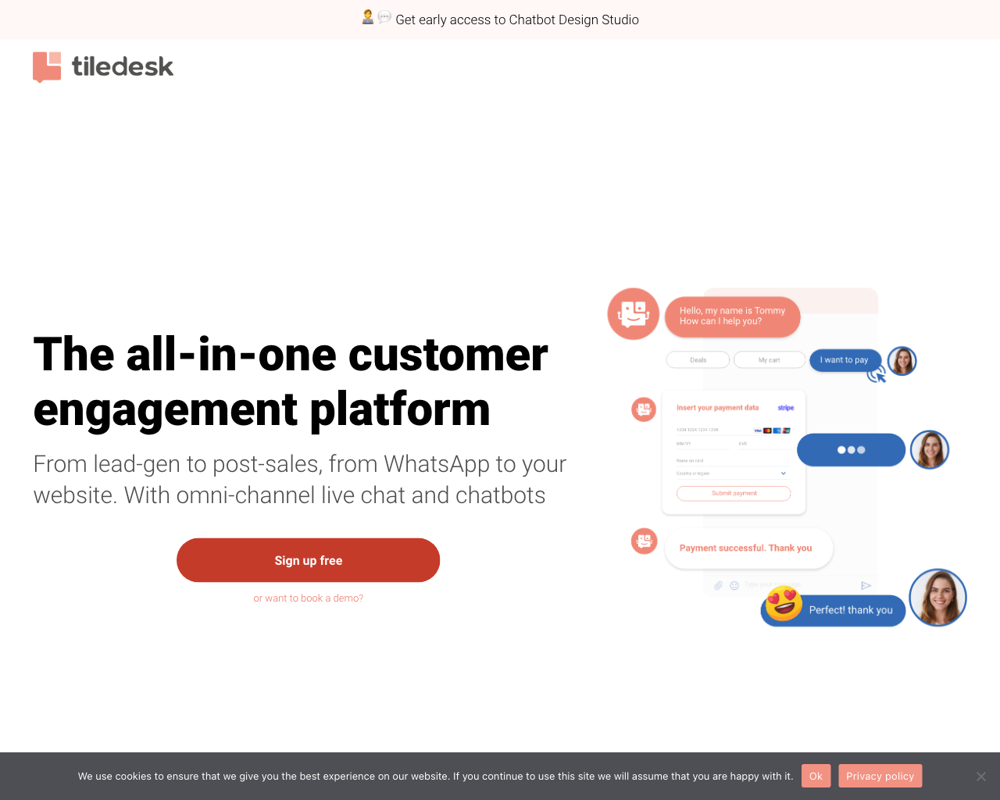
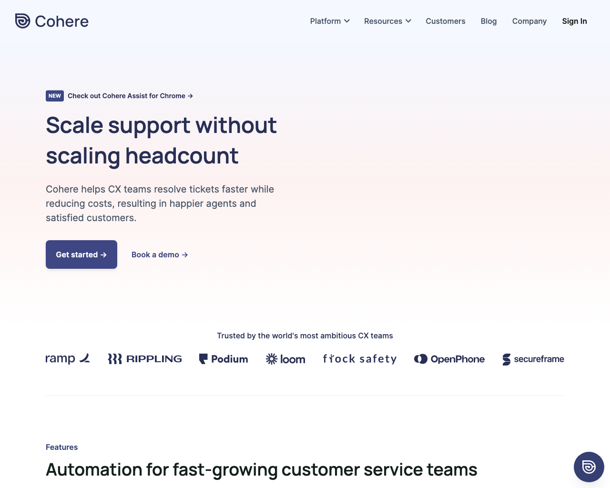
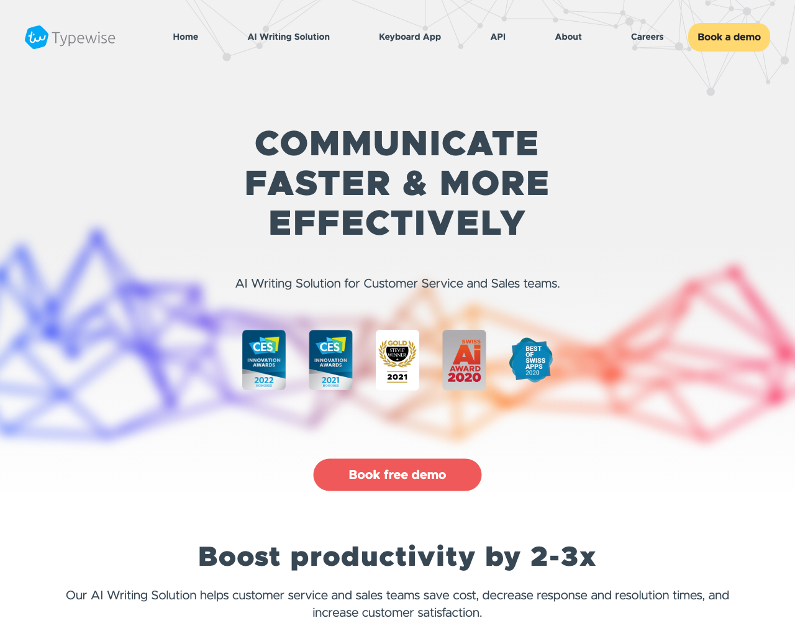
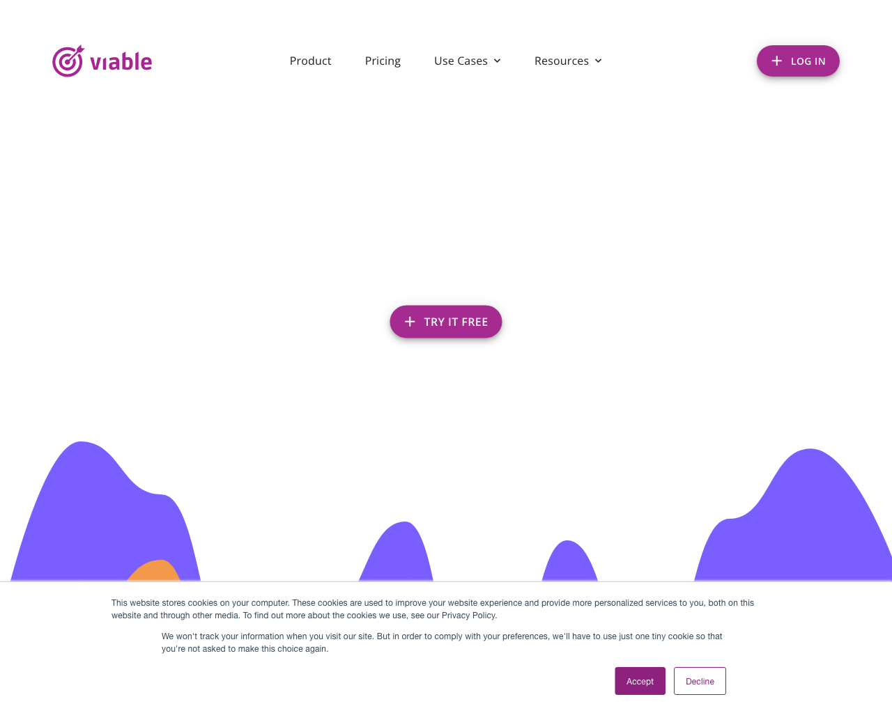
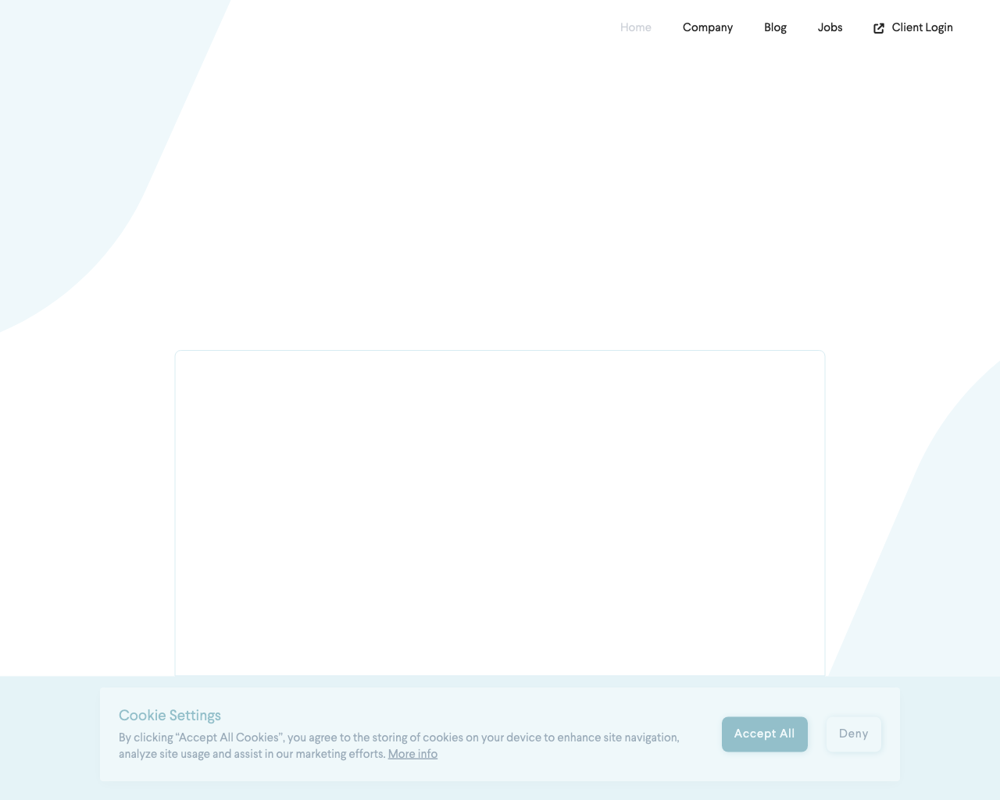
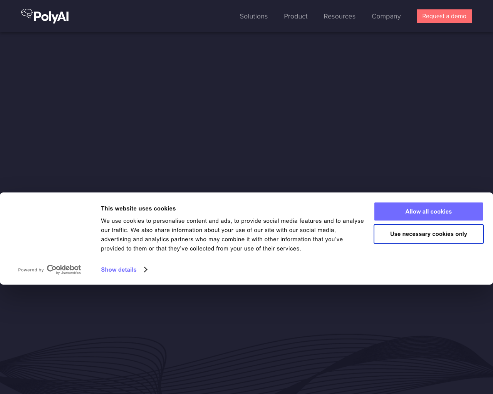
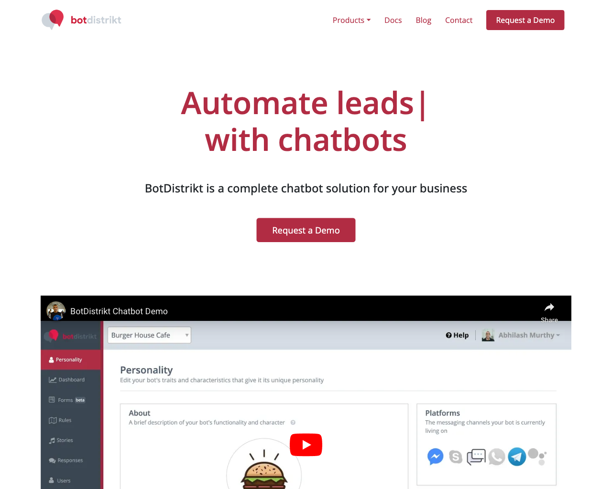
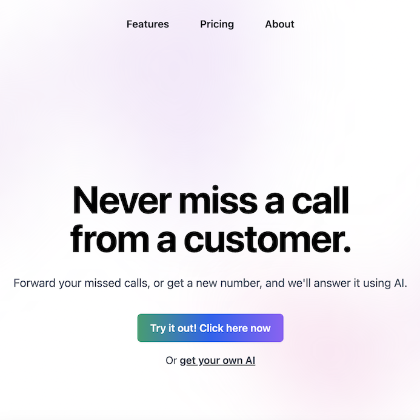

# 🧑‍💻 Customer Support

This page lists a collection of 🧑‍💻 Customer Support tools.

## Tools

### [echowin](https://echo.win)

 
- **Link**: https://echo.win
- **Pricing**: -

### [Ebi.Ai](https://ebi.ai)

 
- **Link**: https://ebi.ai
- **Pricing**: -

### [Tiledesk](https://tiledesk.com)

 
- **Link**: https://tiledesk.com
- **Pricing**: -

### [Regie](https://www.regie.ai)

 
- **Link**: https://www.regie.ai
- **Pricing**: -

### [Adobe Sensei](https://www.adobe.com/br/sensei.html)

 
- **Link**: https://www.adobe.com/br/sensei.html
- **Pricing**: -

### [Maya](https://maya.ai)

 
- **Link**: https://maya.ai
- **Pricing**: -

### [Cohere](https://cohere.io)

 
- **Link**: https://cohere.io
- **Pricing**: -

### [Harvey](https://hiverhq.com/harvey-ai-customer-support)

 
- **Link**: https://hiverhq.com/harvey-ai-customer-support
- **Pricing**: -

### [Typewise](https://www.typewise.app)

 
- **Link**: https://www.typewise.app
- **Pricing**: -

### [Forethought](https://forethought.ai)

 
- **Link**: https://forethought.ai
- **Pricing**: -

### [Quickchat](https://www.quickchat.ai)

 
- **Link**: https://www.quickchat.ai
- **Pricing**: -

### [Vee](https://vee.ai/en)

 
- **Link**: https://vee.ai/en
- **Pricing**: -

### [viable](https://www.askviable.com)

 
- **Link**: https://www.askviable.com
- **Pricing**: -

### [Puzzle](https://www.puzzlelabs.ai)

 
- **Link**: https://www.puzzlelabs.ai
- **Pricing**: -

### [Kaizan](https://kaizan.ai)

 
- **Link**: https://kaizan.ai
- **Pricing**: -

### [Delve](https://www.delve.ai)

 
- **Link**: https://www.delve.ai
- **Pricing**: -

### [Xokind](https://www.xokind.com)

 
- **Link**: https://www.xokind.com
- **Pricing**: -

### [Kore.ai](https://kore.ai)

 
- **Link**: https://kore.ai
- **Pricing**: -

### [Poly.ai](https://poly.ai)

 
- **Link**: https://poly.ai
- **Pricing**: -

### [BotDistrikt](https://www.botdistrikt.com)

 
- **Link**: https://www.botdistrikt.com
- **Pricing**: -

### [Simple Phones](https://simplephones.ai)

 
- **Link**: https://simplephones.ai
- **Pricing**: 19¢/min

[Go back](../README.md) [JSON](json/Customer.json)